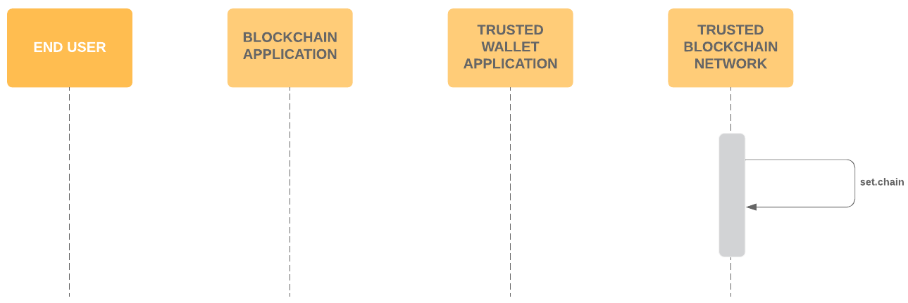
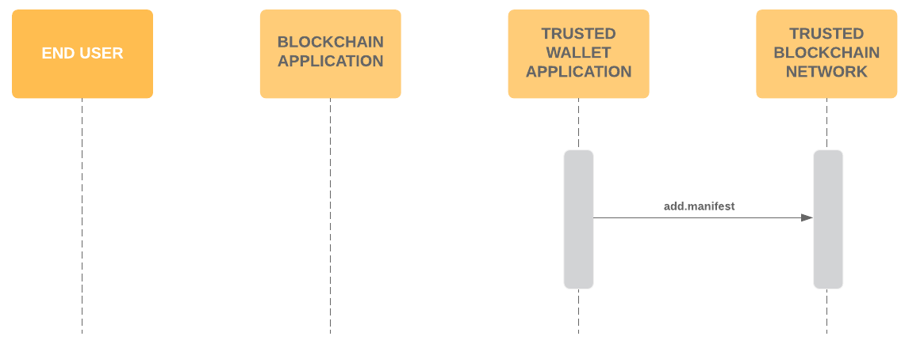
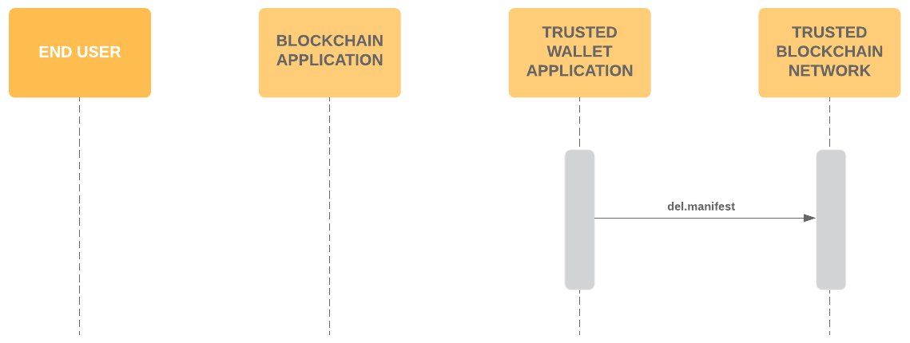

# EOSIO Assert Contract

The EOSIO Assert Contract is a security feature to reduce the need for users to trust blockchain apps when a user signs a transaction for a trusted blockchain network with a trusted wallet application. It is a solution aiming to:

- Allow blockchain networks to register the official chain name and chain icon
- Allow app developers to register one or more manifests describing their application, and 
- Allow app developers to remove previously registered manifests
- Allow users (via some user-agent) to include a “require” action in a transaction that will ensure that the entire transaction is rejected if the required pre-conditions are not valid.

# About EOSIO Labs

EOSIO Labs repositories are experimental.  Developers in the community are encouraged to use EOSIO Labs repositories as the basis for code and concepts to incorporate into their applications. Community members are also welcome to contribute and further develop these repositories. Since these repositories are not supported by Block.one, we may not provide responses to issue reports, pull requests, updates to functionality, or other requests from the community, and we encourage the community to take responsibility for these.

#  Feature Overview
Assert will be a system contract within the EOSIO software.

## Actors
### End-User
The End User is the person who is interacting with a Blockchain Application, and uses a Trusted Wallet Application to sign blockchain transactions when needed. 

### Blockchain Application
The Blockchain Application is the interface that an End User uses to perform some task that will be represented as a blockchain transaction, requiring a signature from an End User, facilitated by a Trusted Wallet Application.

Some Blockchain Applications may appear to be trustworthy, but have malicious intent. Some examples of malicious intent include: a) attempting to trick a user into divulging their private keys, and b) attempting to deceive a user into signing a transaction that does not represent the user’s intended interaction.

### Trusted Wallet Application
The Trusted Wallet Application is where a user stores their private keys, and the interface through which they securely use those private keys to sign blockchain transactions proposed by  Blockchain Applications. It is trusted by implication that it is aware of the End User’s private keys. A Trusted Wallet Application should implement measures to protect the End User from potentially malicious Blockchain Applications.

### Trusted Blockchain Network
The Trusted Blockchain Network is where smart contract code representing the execution of the signed transactions run to produce an agreed upon global state so that users can cooperate through the use of Blockchain Applications. It is the most trusted component because it is often public and decentralized, and because it represents the ultimate source of truth. So the Trusted Blockchain Network is the best place to perform final checks of validity that what is claimed by a Trusted Wallet Application to have been agreed upon by the End User, is accurate and valid in comparison to the current state of the chain.

## Flows
The sequence diagrams in this section describe how and in what order different actors work together when performing actions regarding the Assert Contract.

### eosio.assert::set.chain

Block Producers set chain info for Trusted Blockchain Network

### eosio.assert::add.manifest

Blockchain App publishes manifest to the chain

### eosio.assert::del.manifest

Blockchain App removes a manifest from the chain

### eosio.assert::require

- End User perform an interaction on the Blockchain App that requires signing
- Blockchain App builds eosio.assert::require action, which includes the following:
  - Chain Info Hash
  - Manifest Hash
  - Array of ABI Hashes
  - Array of Contract Actions
- Blockchain App proposes the transaction to the Trusted Wallet App, which includes:
  - eosio.assert::require Action
  - Other actions pertaining to the user’s performed interaction
  - Declared domain
  - Chain Info
  - ABIs
 - Trusted Wallet App gets app manifest from the Blockchain App with the well known url on declared domain and do the following checks:
  - Domain in manifest must match Declared Domain
  - All actions in the transaction must be allowed in the manifest whitelist
- Trusted Wallet App gets app metadata from the Blockchain App and do the following checks:
  - Hash must match app metadata url hash in manifest
  - Chain icon must match hash in metadata
  - App icon must match hash in metadata
- Trusted Wallet App builds eosio.assert::require based on app manifest, app metadata, declared domain, chain info, and ABIs from the Blockchain App, and compares to the eosio.assert::require that is included in the transaction.
- Trusted Wallet App renders and show the Ricardian contract to End User:
  - Render the header from App Metadata, and
  - Render each action from action params, template from ABIs
- End User approve the transaction with Biometrics
- Trusted Wallet App perform the authentication and sign the transaction
- Trusted Wallet App return the signed transaction back to the Blockchain App
- Blockchain App broadcasts the transaction to Trusted Blockchain Network
- Trusted Blockchain Network validates the Assert:
  - Chain Info Accurate
  - Manifest Exists
  - ABIs Accurate
  - Actions in Whitelist

# Functional Specifications
Each function of the EOSIO Assert Contract will be explained in detail in this section, including the actor, requirement, parameters and results.
## eosio.assert::setchain
Allows Block Producers to set chain metadata, so that a Trusted Wallet Application can display chain information to an End User, and ensure that the validity of the information will be validated by the Trusted Blockchain Network by enforcing the inclusion of a valid eosio.assert::require action in every transaction for which it signs a transaction with the private keys of an End User.

| Item | Description |
| --- | --- |
| Contract name |  eosio.assert |
| Action name |  setchain |
| Pre-conditions | Requires eosio authorization |

#### Parameters
- chain_id checksum256 type
- chain_name string
- icon checksum256c 
#### Result 
- Initializes the global state which describes the chain and is required for the contract to work 

## eosio.assert::add.manifest
Allows a Blockchain Application to publish an app manifest to the Trusted Blockchain Network. The manifest allows a Trusted Wallet Application to ensure that: 1) the metadata claimed by a Blockchain Application matches that of a manifest previously registered by the Blockchain Application, 2) the actions included in a transaction proposed by a Blockchain Application are whitelisted in a manifest previously registered by the Blockchain Application.

| Item | Description |
| --- | --- |
| Contract name | eosio.assert |
| Action name | add.manifest |
| Pre-conditions | Action must be authorized by the account which owns the app. The added manifest doesn’t already exist. | 

#### Parameters
- account: the account which owns the app
- domain: the domain the app is hosted on, appmeta: see the manifest spec at [https://github.com/EOSIO/manifest-spec](https://github.com/EOSIO/manifest-spec)
- whitelist: array of (contract, action) pairs that the manifest allows. An empty contract or action indicates a wildcard match. e.g. an empty action name means all actions are allowed for that contract.

#### Result
- The manifest is stored. 
- Checksum256 hash of the manifest data is generated and used as the manifest id. 

## eosio.assert::del.manifest
Allows a Blockchain Application to remove a previously published app manifest from the Trusted Blockchain Network.

| Item | Description |
| --- | --- |
| Contract name | eosio.assert |
| Action name | del.manifest |
| Pre-conditions | Action must be authorized by the account which owns the app. The manifest to be deleted exists.|
#### Parameters
- id: checksum256 id of the manifest. This id was generated upon adding the manifest 
#### Result
- The manifest is deleted 

## eosio.assert::require
When added to a transaction, ‘require’ action performs multiple security checks. If any of the checks fails, the transactions fails.

| Item | Description |
| --- | --- |
| Contract name | eosio.assert |
| Action name | require |
| Pre-conditions | |
#### Parameters
- chain_parameter_hash: identifies the chain. It’s the checksum256 hash of chain_id, chain_name, and icon. These parameters were set when the contract was initialized using setchain action. 
- manifest_id: identifies the manifest. It’s the checksum256 id generated when the manifest was registered. 
- actions: array of (contract, action) pairs in the transaction. Don’t include require action itself. 
- abi_hashes: to fill this field: 1) Create a sorted set of contracts that appear ‘action’ parameters described above. Remove duplicates. 2) For each of the sorted, unique contracts, hash the ABI and append the result to ‘abi_hashes’ parameter. Hash the ABIs in the raw on-chain form, not in the JSON form. 

#### Result 
- ‘require’ action checks the following: 
  - chain_params_hash must match the hash of the chain data registered with ‘setchain’ action. 
  - manifest_id exists 
  - The manifest identified by manifest_id whitelists all the provided actions. See parameter ‘actions’ above. 
  - Contracts have matching ABI hashes 
  - If any of the checks fails, then the transaction will fail.

## Contributing

[Contributing Guide](./CONTRIBUTING.md)

[Code of Conduct](./CONTRIBUTING.md#conduct)

## License

[MIT](./LICENSE)

## Important

See LICENSE for copyright and license terms.  Block.one makes its contribution on a voluntary basis as a member of the EOSIO community and is not responsible for ensuring the overall performance of the software or any related applications.  We make no representation, warranty, guarantee or undertaking in respect of the software or any related documentation, whether expressed or implied, including but not limited to the warranties of merchantability, fitness for a particular purpose and noninfringement. In no event shall we be liable for any claim, damages or other liability, whether in an action of contract, tort or otherwise, arising from, out of or in connection with the software or documentation or the use or other dealings in the software or documentation. Any test results or performance figures are indicative and will not reflect performance under all conditions.  Any reference to any third party or third-party product, service or other resource is not an endorsement or recommendation by Block.one.  We are not responsible, and disclaim any and all responsibility and liability, for your use of or reliance on any of these resources. Third-party resources may be updated, changed or terminated at any time, so the information here may be out of date or inaccurate.  Any person using or offering this software in connection with providing software, goods or services to third parties shall advise such third parties of these license terms, disclaimers and exclusions of liability.  Block.one, EOSIO, EOSIO Labs, EOS, the heptahedron and associated logos are trademarks of Block.one.

Wallets and related components are complex software that require the highest levels of security.  If incorrectly built or used, they may compromise users’ private keys and digital assets. Wallet applications and related components should undergo thorough security evaluations before being used.  Only experienced developers should work with this software.
